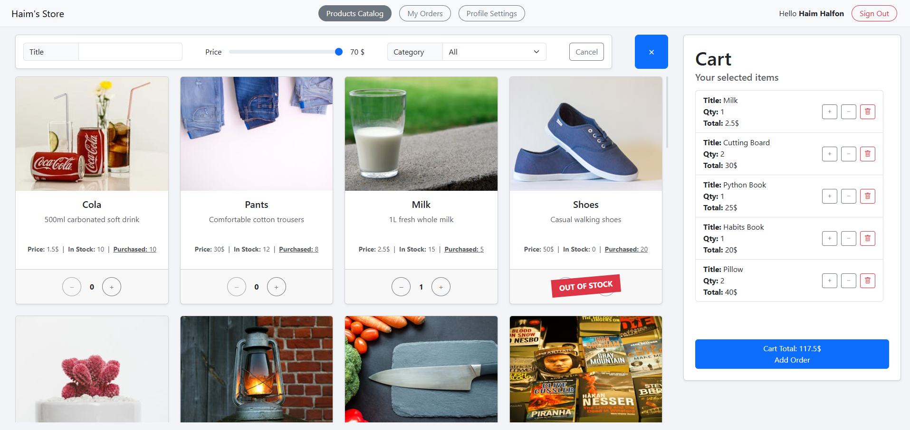

# 🛒 Haim's Store – MERN Stack eCommerce App

A responsive full-featured online store built with the MERN stack (MongoDB, Express.js, React, Node.js).  
The platform supports JWT authentication, role-based access, bcrypt-encrypted passwords, and admin/customer modes.  
Includes live order management, smart filtering, and dynamic charts for sales insights.

---

## 🧠 Features

### 👤 Customer Mode

- Register and log in securely
- Browse a filterable product catalog (title, category, price)
- Add products to real-time cart with quantity and total price
- Place orders and view order history
- View and manage personal data and orders

### 🛠️ Admin Mode

- Role-based access for admin with separate interface
- Manage product catalog (add/update/delete products)
- Manage categories and customer data
- View sales statistics in a dashboard (pie and bar charts)
- Track who bought what and when

---

## 🧰 Technologies Used

- ⚛️ React (with Vite) and Redux
- 🌍 Node.js + Express
- 🗄️ MongoDB with Mongoose
- 🔐 JWT for authentication
- 🔒 Bcrypt for password hashing
- 🎨 Bootstrap 5
- 📊 Chart.js / Recharts

---

## 🚀 How to Run Locally

```bash
# Clone the repository
git clone https://github.com/HaimHalfon/HaimsStore.git

# Navigate into the project folder
cd HaimsStore
```

You need two terminals: one for the backend and one for the frontend.

### 🖥️ Terminal 1 – Server

```bash
# Navigate to the server folder
cd server

# Install dependencies
npm install

# Set environment variables (create .env file in /server)
PORT=3000
MONGO_URI=mongodb://localhost:27017/your-db-name
JWT_SECRET=yourSecretKey
JWT_EXPIRES_IN=3h

# Seed the database (initial test data)
npm run seed

# Start the server
npm start
```

### 🖥️ Terminal 2 – Client

```bash
# Navigate to the client folder
cd client

# Install dependencies
npm install

# Start the Vite development server
npm start
```

Then visit: `http://localhost:5173`

---

## 📷 Screenshot


